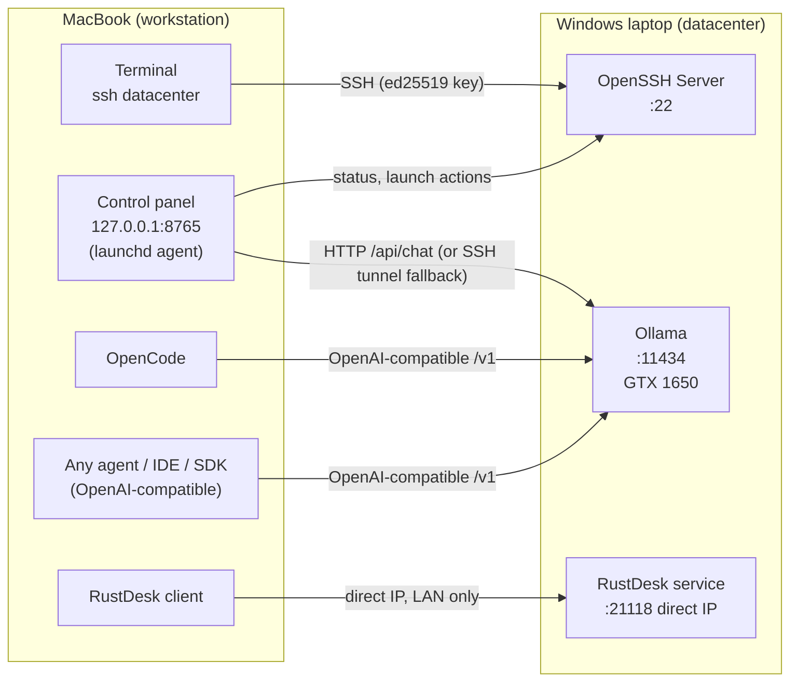

# I Turned a Spare Windows Laptop into a Zero-Cost Private AI Datacenter for My Mac

*A system design walkthrough: requirements, architecture, trade-offs, the actual build and benchmarks. Total spend: ₹0.*

---

## TL;DR

I had a MacBook (Apple M4) that I love working on, and a Windows gaming laptop with an NVIDIA GPU that mostly sat idle. I wanted the Mac to stay my only workstation while the Windows machine became a headless "datacenter" I could use from it: a remote shell, a remote screen when needed, and local LLMs served over my home network.

The result:

- `ssh datacenter` drops me into PowerShell on the Windows box, with key-based auth and no passwords.
- **RustDesk** is my remote control: the full Windows desktop in a window on the Mac, over direct IP with no third-party relay.
- Ollama on the Windows GPU serves models to the Mac over the LAN.
- A small control panel on the Mac (`http://127.0.0.1:8765`) shows health, launches sessions and chats with the models. It starts automatically at login.
- **Portable to any agent.** The models sit behind a standard OpenAI-compatible API, so any coding agent, IDE extension or SDK that accepts a custom base URL can use them. I use OpenCode as the example; swapping in another agent is a config change.
- **Zero cost.** Every component is free or open source, running on hardware I already owned. No subscriptions, no API bills, no cloud.

**By the numbers** (measured from the Mac over Wi-Fi):

| Metric | Result |
|---|---|
| Network round trip to the datacenter | **4.6 ms** p50 |
| Chat model (`qwen2.5:3b`) generation speed | **54.9 tok/s** |
| Autocomplete model (`qwen2.5-coder:1.5b`) generation speed | **89.5 tok/s** |
| Time to first token, warm | **< 65 ms** for every model |
| Network share of total response time | **~0.1%** |
| Monthly cost | **₹0** |

---

## 1. The problem

| | |
|---|---|
| **Primary workstation** | MacBook, Apple M4, macOS 15.7 |
| **Idle hardware** | Windows 11 Home laptop, Intel i5-10300H, 8 GB RAM, NVIDIA GTX 1650 (4 GB VRAM) |
| **Network** | Both on the same home Wi-Fi/LAN |

I didn't want to juggle two keyboards or two desktops. I wanted one seat (the Mac) and one box of compute (the Windows laptop), the way you'd use a server in a rack.

### Functional requirements

1. Run commands on the Windows machine from the Mac terminal.
2. See and control the Windows desktop from the Mac when a GUI is unavoidable.
3. Host LLMs on the Windows GPU and call them from the Mac (CLI, HTTP API and agents).
4. Use those local models from any coding agent, not only a chat box.
5. Reconnect with zero manual steps after either machine reboots.

### Non-functional requirements

- **Zero cost:** free and open-source tools only, on hardware I already have.
- **Private:** code and prompts stay on my LAN. No cloud relays for model traffic.
- **Portable:** no lock-in to one agent or editor. Standard APIs only.
- **Secure by default:** nothing exposed to the internet, key-based auth, least-privilege firewall rules.
- **Non-destructive:** keep Windows as-is, with no wipe or reinstall.
- **Low friction:** no commands to memorize for day-to-day use.

---

## 2. Architecture



### Component responsibilities

| Layer | Component | Role |
|---|---|---|
| Access (CLI) | OpenSSH Server on Windows, `~/.ssh/config` alias on the Mac | Remote shell, remote commands, port forwarding |
| Remote control (GUI) | RustDesk (direct IP mode) | See and control the Windows desktop from the Mac |
| Compute | Ollama on the GTX 1650 | Model serving: native API plus an OpenAI-compatible `/v1` |
| Control plane | `dc_panel.py` plus a launchd agent | Health checks, one-click launchers, chat UI, tunnel self-healing |
| Clients | OpenCode, any OpenAI-compatible agent, the `ollama` CLI, curl | Consumers of the model API |

---

## 3. Design decisions and trade-offs

### 3.1 Remote access: SSH for the terminal, RustDesk for remote control

| Option | Verdict | Why |
|---|---|---|
| **SSH** | ✅ Primary | Built into both OSes, scriptable, encrypted, near-zero overhead, and gives port forwarding for free |
| Windows Remote Desktop | ❌ | Windows **Home** can't act as a Remote Desktop host |
| **RustDesk** | ✅ Remote control | Free and open source (AGPL), works on Home, supports **direct IP** so traffic stays on the LAN |
| remotecontrol-desktop | ❌ | Small project, documented keyboard issues, relays through a public server by default |
| Sunshine + Moonlight | Maybe later | Best latency for GPU and graphics work, but overkill for now |

### 3.2 How the Mac reaches Ollama

Ollama listens on `localhost` by default. There are two ways to reach it from another machine:

| Approach | Pros | Cons |
|---|---|---|
| **SSH local forward** (`-L 11435:localhost:11434`) | No new ports, encrypted, no Windows config change | Needs a tunnel process running |
| **Bind Ollama to the LAN** (`OLLAMA_HOST=0.0.0.0`) with a firewall rule on the Private profile | Simple URL, works with any client | Plain HTTP on the LAN, and the firewall must be scoped carefully |

**Decision: both.** Clients use the direct LAN endpoint. The control panel checks it first and **falls back to an SSH tunnel automatically** when it's unreachable. That fallback is what makes the system self-heal after a Windows reboot, when Ollama isn't up yet.

### 3.3 Portable to any agent

The key design choice: **the datacenter speaks a standard protocol, not a tool-specific one.** Ollama exposes two interfaces:

| Interface | Endpoint | Who uses it |
|---|---|---|
| Native Ollama API | `http://<windows-lan-ip>:11434/api/...` | The `ollama` CLI, the control panel, tools with an "Ollama" provider |
| **OpenAI-compatible API** | `http://<windows-lan-ip>:11434/v1` | Practically every agent, IDE extension and SDK |

Because the OpenAI chat-completions format is the de facto standard, the models plug into anything that lets you set a **base URL** and a **model name**:

- terminal coding agents (OpenCode, Aider, and similar)
- IDE extensions with a custom or Ollama provider (Continue, Cline, and similar)
- chat UIs (Open WebUI, Enchanted)
- your own code, through the OpenAI SDK or frameworks like LangChain and the Vercel AI SDK

Switching agents means changing one config file, not rebuilding infrastructure. The only rule: the tool must call the model **from your own machine**. Tools that route "custom model" requests through their vendor's cloud can't reach a LAN address, and working around that would mean exposing the model to the internet.

### 3.4 Model sizing for a 4 GB GPU

VRAM is the binding constraint.

| Model | Loaded size | Fits in 4 GB VRAM? | Use |
|---|---|---|---|
| `qwen2.5-coder:1.5b-base` | 1.39 GB (measured) | ✅ 100% | Autocomplete (fill-in-the-middle) |
| `nomic-embed-text` | ~0.3 GB | ✅ | Embeddings for codebase search |
| `qwen2.5:3b` | 2.34 GB (measured) | ✅ 100% | Chat, quick edits |
| `qwen2.5:3b-32k` | 3.00 GB (measured) | ⚠️ 79% | Agent work |
| `qwen2.5-coder:7b` | ~4.7 GB (download size) | ❌ Partially | Would spill heavily onto the CPU |

"Loaded size" is what Ollama reports in memory, weights plus KV cache, which is why the same 3B model is bigger with a larger context.

### 3.5 Context window: the hidden gotcha

Ollama's default context window is small. Coding agents send a **large system prompt plus tool definitions** before your first word. With a small window the prompt gets truncated and the model "forgets" its tools.

Fix: create a variant with a 32K context.

```bash
curl http://<windows-lan-ip>:11434/api/create -d '{
  "model": "qwen2.5:3b-32k",
  "from": "qwen2.5:3b",
  "parameters": { "num_ctx": 32768 }
}'
```

More context costs more memory for the KV cache, so on a 4 GB card it's a trade-off between context size and speed. I measured it (section 5): the 32K variant grows from 2.34 GB to 3.00 GB, 21% of it no longer fits in VRAM, and generation drops from 54.9 to 32.7 tok/s. So I use the 32K variant only for agents, and the plain model for chat and quick edits.

---

## 4. The build, step by step

> IPs, usernames and keys are redacted. Replace `<windows-lan-ip>` and `<user>` with your own.

### Step 1: OpenSSH Server on Windows

I followed Microsoft's guide, [Get started with OpenSSH for Windows](https://learn.microsoft.com/windows-server/administration/openssh/openssh_install_firstuse). The result:

- The `sshd` service running, set to start automatically.
- Port 22 allowed on the **Private** network profile only.
- PowerShell as the default SSH shell.

On my machine the standard "Optional Features" install failed, so I installed Microsoft's OpenSSH package through **winget** instead.

### Step 2: Key-based auth from the Mac

```bash
ssh-keygen -t ed25519 -f ~/.ssh/id_ed25519
```

For accounts in the **Administrators** group, Windows OpenSSH ignores `~\.ssh\authorized_keys`. The key has to go in `C:\ProgramData\ssh\administrators_authorized_keys`, and that file must be locked down to Administrators and SYSTEM. See Microsoft's [key-based authentication guide](https://learn.microsoft.com/windows-server/administration/openssh/openssh_keymanagement).

I pasted the public key into an **elevated** PowerShell through the RustDesk session.

### Step 3: One alias to rule them all

```sshconfig
# ~/.ssh/config
Host datacenter
    HostName <windows-lan-ip>
    User <user>
    IdentityFile ~/.ssh/id_ed25519
    ServerAliveInterval 60
```

```bash
$ ssh datacenter "whoami; hostname"
<pc-name>\<user>
<PC-NAME>
```

### Step 4: Remote control with RustDesk (LAN only)

- Installed RustDesk on both machines: `winget install RustDesk.RustDesk` on Windows, `brew install --cask rustdesk` on the Mac.
- On Windows, under **Settings → Security**, I turned on **Enable direct IP access** and set a strong permanent password.
- On the Mac, I type the Windows LAN IP into RustDesk to connect peer-to-peer, with no relay server involved.
- For a "headless" feel, **Privacy mode** blanks the physical screen and blocks local input while I'm connected.

### Step 5: Serving models with Ollama

```bash
ollama pull qwen2.5:3b
ollama pull qwen2.5-coder:1.5b-base
ollama pull nomic-embed-text
```

From the Mac, the `ollama` CLI acts as a thin client:

```bash
export OLLAMA_HOST=<windows-lan-ip>:11434   # in ~/.zshrc
ollama list
ollama run qwen2.5:3b
```

Or through the raw API:

```bash
curl http://<windows-lan-ip>:11434/api/generate \
  -d '{"model":"qwen2.5:3b","prompt":"Hi","stream":false}'
```

### Step 6: The control panel, a GUI for the datacenter

Once everything worked, I had a new problem: too many commands to remember. `ssh datacenter`, the tunnel flags, the Ollama model names, the RustDesk address. So I built a small web GUI that runs on the Mac and puts the whole datacenter behind one bookmark: `http://127.0.0.1:8765`.

> 📸 **Screenshot:** the full control panel *(to be added)*

#### What it does

The page has three cards.

**1. Status.** Three lights show whether each service on the Windows box is reachable right now:

- **SSH:** can the Mac open a connection to port 22?
- **Ollama:** does the model server actually answer (a real `/api/tags` request, not just an open port)?
- **RustDesk:** is the remote-control service listening?

Green means healthy, red means down, and a **Refresh** button re-checks on demand. It's the first thing I look at after either machine restarts.

> 📸 **Screenshot:** status lights, all green *(to be added)*

**2. Open.** One-click launchers for everything I used to type by hand:

| Button | What it opens |
|---|---|
| **Terminal** | A new macOS Terminal window already logged in to PowerShell on Windows |
| **Claude Code** | Claude Code running on the Windows box, over SSH |
| **VS Code** | VS Code connected to Windows through Remote-SSH |
| **Screen** | RustDesk, for full remote control of the Windows desktop |
| **GPU monitor** | A live `nvidia-smi` view that refreshes every 2 seconds |

> 📸 **Screenshot:** the launcher buttons *(to be added)*

**3. Ollama chat.** A ChatGPT-style chat running entirely on my own GPU:

- A dropdown lists every model installed on the Windows box, and the panel remembers the last one I picked.
- Answers **stream in token by token**, so even a slow model feels responsive.
- The conversation keeps its history, so follow-up questions work, and **New chat** starts fresh.
- **Enter** sends; **Shift+Enter** adds a new line.

> 📸 **Screenshot:** a streaming chat with qwen2.5 3B *(to be added)*

The page follows the Mac's light or dark mode automatically.

#### How it's built

The whole panel is **one Python file with zero dependencies**: just the standard library's `http.server`, with the HTML, CSS and JavaScript embedded. No npm, no frameworks, nothing to install.

```
Browser (127.0.0.1:8765)
   │
   ├── GET  /                  → the page
   ├── GET  /api/status        → TCP checks for SSH and RustDesk, a real request to Ollama
   ├── GET  /api/models        → model list from Ollama
   ├── POST /api/chat          → proxied to Ollama, streamed back line by line
   └── POST /api/open/<name>   → one of five fixed launch actions
   │
dc_panel.py (Python standard library)
   │
   ├── direct LAN   → Ollama :11434
   └── fallback     → SSH tunnel → Ollama (auto-started, auto-restarted)
```

Chat requests go through the panel rather than straight from the browser to Ollama. That avoids browser cross-origin restrictions, and it means the browser never needs to know where the Windows box actually is.

#### Design choices

- **Local only.** The server binds to `127.0.0.1`, so nothing else on the network, not even another device at home, can open it.
- **No arbitrary commands.** The launch endpoint accepts only five named actions from a fixed list. There is no way to send a shell command through the HTTP API.
- **The Windows IP never reaches the browser.** It isn't in the page, and any error message that would contain it is rewritten to say `windows-pc` instead. That keeps it out of screenshots, including the ones in this post.
- **Self-healing connection.** Every request first checks whether Ollama is reachable directly on the LAN. If it isn't, the panel starts an SSH tunnel on a local port (with keepalives), and if that tunnel ever dies, the next request restarts it:

```python
def ensure_ollama():
    if port_open(11434):                       # direct LAN path is healthy
        OLLAMA_URL = f"http://{HOST_IP}:11434"; return
    OLLAMA_URL = "http://127.0.0.1:11435"      # otherwise, use the tunnel
    if TUNNEL is None or TUNNEL.poll() is not None:
        TUNNEL = subprocess.Popen(["ssh", "-N", "-o", "BatchMode=yes",
            "-o", "ServerAliveInterval=30",
            "-L", "11435:localhost:11434", "datacenter"])
```

- **Always on.** A launchd agent (Step 7) starts the panel at login and restarts it if it ever exits, so the bookmark simply works after every reboot.

### Step 7: Survive reboots with launchd

```xml
<!-- ~/Library/LaunchAgents/com.rajathmr.dcpanel.plist -->
<key>ProgramArguments</key>
<array>
  <string>/usr/bin/python3</string>
  <string>/Users/rajathmr/datacenter/dc_panel.py</string>
</array>
<key>RunAtLoad</key><true/>
<key>KeepAlive</key><true/>
```

```bash
launchctl bootstrap gui/$(id -u) ~/Library/LaunchAgents/com.rajathmr.dcpanel.plist
launchctl kickstart -k gui/$(id -u)/com.rajathmr.dcpanel   # restart
```

On the Windows side: `sshd` starts automatically, RustDesk runs as a service, Ollama starts at user login, and sleep is set to **Never** while plugged in.

### Step 8: Plugging in an agent (OpenCode as the example)

`~/.config/opencode/opencode.json`:

```json
{
  "$schema": "https://opencode.ai/config.json",
  "model": "ollama/qwen2.5:3b-32k",
  "provider": {
    "ollama": {
      "npm": "@ai-sdk/openai-compatible",
      "name": "Ollama (Windows)",
      "options": { "baseURL": "http://<windows-lan-ip>:11434/v1" },
      "models": {
        "qwen2.5:3b-32k": { "name": "Qwen2.5 3B (32K context)", "tools": true }
      }
    }
  }
}
```

```bash
cd ~/my-project
opencode              # full TUI; /models to switch
opencode run "explain index.html"
```

### Step 9: Any other agent

Every agent needs the same three values:

| Setting | Value |
|---|---|
| Base URL | `http://<windows-lan-ip>:11434/v1` |
| API key | any non-empty string, e.g. `ollama` (Ollama ignores it) |
| Model | `qwen2.5:3b-32k` for agents, `qwen2.5:3b` for chat |

Many tools read the standard environment variables:

```bash
export OPENAI_BASE_URL=http://<windows-lan-ip>:11434/v1
export OPENAI_API_KEY=ollama
```

Or in your own code:

```python
from openai import OpenAI

client = OpenAI(base_url="http://<windows-lan-ip>:11434/v1", api_key="ollama")
reply = client.chat.completions.create(
    model="qwen2.5:3b",
    messages=[{"role": "user", "content": "Hello from my datacenter"}],
)
print(reply.choices[0].message.content)
```

---

## 5. Benchmarks

### Methodology

All measurements run **from the Mac, over Wi-Fi**, against the Windows box, using [`bench.py`](bench.py) (standard library only):

- **Network:** TCP connect round-trip time to `:22` and `:11434`, 20 samples each, reporting p50 and p95. ICMP ping is blocked by the Windows firewall, so TCP connect is the honest latency probe.
- **Cold load:** unload the model (`keep_alive: 0`), then time a one-token request.
- **Throughput:** Ollama's own `eval_count / eval_duration` (generation tokens/s) and `prompt_eval_count / prompt_eval_duration` (prompt-processing tokens/s).
- **User-perceived latency:** time to first token (TTFT) over a streaming request, plus end-to-end time for a request capped at 256 tokens.
- **Workloads:** short answer, code generation, ~150-word explanation. 3 runs each, `temperature: 0`.
- **Memory:** `/api/ps` reports total model size and how much of it sits in VRAM, which reveals CPU offload.

```bash
DC_HOST=<windows-lan-ip> python3 bench.py > bench_results.json
```

### Results

Raw output is in [`bench_results.json`](bench_results.json).

**Network (Mac → Windows, Wi-Fi, 20 samples)**

| Probe | min | p50 | p95 |
|---|---|---|---|
| TCP connect :22 (SSH) | 3.71 ms | 4.64 ms | 6.32 ms |
| TCP connect :11434 (Ollama) | 4.19 ms | 4.99 ms | 6.46 ms |

**Models on the GTX 1650 (4 GB), code-generation workload, 256 output tokens**

| Model | Cold load | In VRAM / total | Gen tok/s | Prompt tok/s | TTFT p50 | End-to-end p50 |
|---|---|---|---|---|---|---|
| `qwen2.5-coder:1.5b-base` | 5.4 s | 1.39 / 1.39 GB (100%) | **89.5** | 878 | 35 ms | 2.95 s |
| `qwen2.5:3b` | 6.8 s | 2.34 / 2.34 GB (100%) | **54.9** | 1,631 | 46 ms | 4.76 s |
| `qwen2.5:3b-32k` | 7.6 s | 2.37 / 3.00 GB (79%) | **32.7** | 912 | 61 ms | 7.96 s |

**Generation speed across all three workloads (tokens/s)**

| Model | Short answer | Code | ~150-word explanation |
|---|---|---|---|
| `qwen2.5-coder:1.5b-base` | 127.5* | 89.5 | 86.8 |
| `qwen2.5:3b` | 58.1 | 54.9 | 53.4 |
| `qwen2.5:3b-32k` | 35.1 | 32.7 | 32.3 |

\* The base (completion) model produced only about 3 tokens for the short prompt, so that figure is noisy.

### What the numbers say

1. **The network is a rounding error.** A 4.6 ms round trip against a 4.76 s generation is about **0.1% overhead**. Serving models over home Wi-Fi costs effectively nothing; the GPU is the bottleneck.
2. **The 32K context has a real price on a 4 GB card.** The bigger KV cache pushes the model to 3.0 GB, and only 79% of it fits in VRAM. The rest spills to the CPU, and generation drops from 54.9 to 32.7 tok/s (**−40%**), while end-to-end time grows by **67%**. It's worth it for agents, which need the context, but chat and quick edits should use the plain `qwen2.5:3b`.
3. **The 1.5B coder is the right autocomplete model.** At about 90 tok/s with a 35 ms time to first token, it's fast enough for inline suggestions.
4. **Time to first token stays under 65 ms for every model once warm.** Responses feel instant; only the total length determines the wait.
5. **Cold starts take 5–8 s.** Ollama unloads idle models, so the first request after a pause pays this cost. Raising `keep_alive` would avoid it, at the price of holding VRAM.

---

## 6. Security model

| Surface | Exposure | Control |
|---|---|---|
| SSH :22 | LAN only | Key auth (ed25519), firewall scoped to the Private profile |
| RustDesk :21118 | LAN only (direct IP) | Strong permanent password, no public relay |
| Ollama :11434 | LAN only | Private profile. Ollama has **no auth**, so never port-forward it on the router |
| Control panel :8765 | Mac loopback only | Bound to `127.0.0.1`, fixed action allowlist, IP redacted in the UI |

No router port-forwarding and no public tunnels, on purpose. Nothing in this setup is reachable from the internet.

---

## 7. Zero-cost bill of materials

| Component | Role | License / price | Cost |
|---|---|---|---|
| Windows laptop (GTX 1650) | Compute | Already owned | ₹0 |
| MacBook | Workstation | Already owned | ₹0 |
| OpenSSH | Remote shell, tunnels | Built into macOS and Windows | ₹0 |
| RustDesk | Remote control | Open source (AGPL-3.0) | ₹0 |
| Ollama | Model serving | Open source (MIT) | ₹0 |
| Qwen2.5 models | LLMs | Open weights | ₹0 |
| nomic-embed-text | Embeddings | Open weights (Apache-2.0) | ₹0 |
| OpenCode | Coding agent | Open source (MIT) | ₹0 |
| Python 3, launchd | Control panel, auto-start | Built into macOS | ₹0 |
| **Total** | | | **₹0** |

The only running cost is electricity for the Windows laptop. There are no API tokens to pay for: every prompt is processed on my own GPU.

---

## Stack

**Mac:** macOS 15.7 · Apple M4 · OpenSSH · RustDesk · Python 3 (standard library) · launchd · OpenCode
**Windows:** Windows 11 Home · i5-10300H · 8 GB RAM · GTX 1650 4 GB · OpenSSH Server · RustDesk · Ollama 0.34.4
**Models:** qwen2.5:3b · qwen2.5:3b-32k · qwen2.5-coder:1.5b-base · nomic-embed-text

*Built on a weekend. Zero cost, zero cloud, and it works with any agent.*
