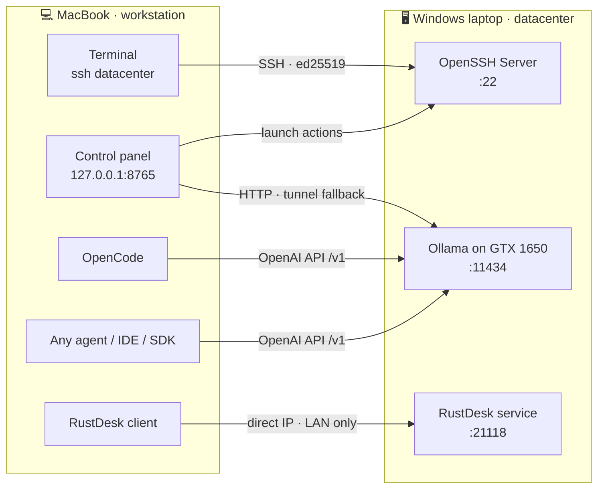

<div align="center">

# 🖥️ Zero-Cost Private AI Datacenter

**I turned a spare Windows gaming laptop into a private GPU server for my Mac,<br>and plugged local LLMs into any coding agent, for ₹0.**


[Architecture](#-architecture) · [Build guide](#-the-build-step-by-step) · [Control panel](#step-6-the-control-panel) · [Benchmarks](#-benchmarks) · [Quick start](#-quick-start)

</div>

---

## ✨ At a glance

| | |
|---|---|
| ⚡ **4.6 ms** | network round trip, Mac → datacenter (median) |
| 🚀 **54.9 tok/s** | chat model, `qwen2.5:3b` |
| ⌨️ **89.5 tok/s** | autocomplete model, `qwen2.5-coder:1.5b` |
| ⏱️ **< 65 ms** | time to first token, every model, warm |
| 📡 **~0.1%** | share of response time spent on the network |
| 💸 **₹0 / month** | no subscriptions, no API bills, no cloud |

**What you get**

- 🔑 **One-command shell:** `ssh datacenter` opens PowerShell on the Windows box, key-based, no passwords.
- 🖱️ **Remote control with RustDesk:** the full Windows desktop in a window on the Mac, direct over the LAN, no relay.
- 🧠 **Local LLMs on the GPU:** Ollama serves models to the Mac over the home network.
- 🎛️ **A control panel:** one local web page for health checks, one-click launchers and a streaming chat. Starts at login.
- 🔌 **Portable to any agent:** a standard OpenAI-compatible API, so any agent, IDE extension or SDK works with a one-line config change.

---

## 📑 Contents

1. [The problem](#-the-problem)
2. [Architecture](#-architecture)
3. [Design decisions](#-design-decisions-and-trade-offs)
4. [The build, step by step](#-the-build-step-by-step)
5. [Benchmarks](#-benchmarks)
6. [Security model](#-security-model)
7. [Zero-cost bill of materials](#-zero-cost-bill-of-materials)
8. [Quick start](#-quick-start)

---

## 🎯 The problem

| | |
|---|---|
| **Workstation** | MacBook · Apple M4 · macOS 15.7 |
| **Idle hardware** | Windows 11 Home laptop · Intel i5-10300H · 8 GB RAM · NVIDIA GTX 1650 (4 GB VRAM) |
| **Network** | Both on the same home Wi-Fi |

I didn't want two keyboards or two desktops. I wanted **one seat** (the Mac) and **one box of compute** (the laptop), the way you'd use a server in a rack.

<table>
<tr><th>Functional requirements</th><th>Non-functional requirements</th></tr>
<tr><td valign="top">

1. Run commands on Windows from the Mac terminal
2. See and control the Windows desktop when a GUI is unavoidable
3. Host LLMs on the Windows GPU and call them from the Mac
4. Use those models from any coding agent, not just a chat box
5. Reconnect automatically after either machine reboots

</td><td valign="top">

- **Zero cost:** free and open-source tools, existing hardware
- **Private:** code and prompts never leave the LAN
- **Portable:** no lock-in to one agent or editor
- **Secure by default:** nothing exposed to the internet
- **Non-destructive:** keep Windows as it is
- **Low friction:** no commands to memorize

</td></tr>
</table>

---

## 🧱 Architecture



| Layer | Component | Role |
|---|---|---|
| 🔑 Shell | OpenSSH Server + `datacenter` alias in `~/.ssh/config` | Remote commands, port forwarding |
| 🖱️ Remote control | RustDesk, direct-IP mode | See and control the Windows desktop |
| 🧠 Compute | Ollama on the GTX 1650 | Native API + OpenAI-compatible `/v1` |
| 🎛️ Control plane | [`panel/dc_panel.py`](panel/dc_panel.py) + launchd | Health, launchers, chat, self-healing tunnel |
| 🔌 Clients | OpenCode, any OpenAI-compatible agent, `ollama` CLI, curl | Consume the model API |

---

## 🧭 Design decisions and trade-offs

### Shell over SSH, screen over RustDesk

| Option | Verdict | Why |
|---|:---:|---|
| **SSH** | ✅ | Built into both OSes, encrypted, scriptable, near-zero overhead, free port forwarding |
| Windows Remote Desktop | ❌ | Windows **Home** can't host Remote Desktop |
| **RustDesk** | ✅ | Open source (AGPL), works on Home, **direct IP** keeps traffic on the LAN |
| remotecontrol-desktop | ❌ | Small project, known keyboard issues, public relay by default |
| Sunshine + Moonlight | ⏳ | Best for graphics-heavy work; overkill for now |

### How the Mac reaches the models

| Approach | 👍 | 👎 |
|---|---|---|
| **SSH tunnel** (`-L 11435:localhost:11434`) | No new ports, encrypted | Needs a running tunnel process |
| **Ollama on the LAN** (`OLLAMA_HOST=0.0.0.0`) | Simple URL for every client | Plain HTTP; firewall must be scoped to private networks |

**Decision: both.** Clients use the direct address; the control panel falls back to an SSH tunnel automatically when that fails. That fallback is what lets the system heal itself after a Windows reboot.

### 🔌 Portable to any agent

The datacenter speaks a **standard protocol**, not a tool-specific one:

| Interface | Endpoint | Used by |
|---|---|---|
| Native Ollama API | `http://<windows-lan-ip>:11434/api/…` | `ollama` CLI, the control panel |
| **OpenAI-compatible API** | `http://<windows-lan-ip>:11434/v1` | Practically every agent, extension and SDK |

Anything that accepts a **base URL** and a **model name** works: terminal agents (OpenCode, Aider), editor extensions (Continue, Cline), chat UIs (Open WebUI) and your own code (OpenAI SDK, LangChain, Vercel AI SDK).

> [!IMPORTANT]
> The tool must call the model **from your own machine**. Tools that route "custom model" requests through their vendor's cloud can't reach a LAN address, and working around that would mean exposing the model to the internet.

### Choosing models for a 4 GB GPU

| Model | Loaded size | Fits in VRAM | Use |
|---|---|:---:|---|
| `qwen2.5-coder:1.5b-base` | 1.39 GB | ✅ 100% | Autocomplete |
| `nomic-embed-text` | ~0.3 GB | ✅ | Embeddings for code search |
| `qwen2.5:3b` | 2.34 GB | ✅ 100% | Chat, quick edits |
| `qwen2.5:3b-32k` | 3.00 GB | ⚠️ 79% | Agent work |
| `qwen2.5-coder:7b` | ~4.7 GB | ❌ | Would spill heavily onto the CPU |

### The hidden gotcha: context size

Coding agents send a long system prompt plus tool definitions before your first word. With Ollama's small default context, that gets cut off and the model "forgets" its tools.

```bash
curl http://<windows-lan-ip>:11434/api/create -d '{
  "model": "qwen2.5:3b-32k",
  "from": "qwen2.5:3b",
  "parameters": { "num_ctx": 32768 }
}'
```

> [!TIP]
> A bigger context costs memory. On a 4 GB card the 32K variant grows to 3.00 GB, spills 21% onto the CPU and generates **40% slower**. Use it for agents only, and the plain model for chat.

---

## 🔧 The build, step by step

> [!NOTE]
> IPs, usernames and keys are replaced with placeholders like `<windows-lan-ip>` and `<user>`.

### Step 1: SSH server on Windows

Followed Microsoft's [Get started with OpenSSH for Windows](https://learn.microsoft.com/windows-server/administration/openssh/openssh_install_firstuse):

- `sshd` running and set to start automatically
- Port 22 allowed on the **Private** network profile only
- PowerShell as the default SSH shell

If the "Optional Features" installer fails (it did for me), install Microsoft's OpenSSH package through **winget** instead.

### Step 2: Password-free login

```bash
ssh-keygen -t ed25519 -f ~/.ssh/id_ed25519
```

> [!WARNING]
> For **administrator** accounts, Windows OpenSSH ignores the per-user `authorized_keys`. The key must go in `C:\ProgramData\ssh\administrators_authorized_keys`, readable only by Administrators and SYSTEM. See Microsoft's [key-based authentication guide](https://learn.microsoft.com/windows-server/administration/openssh/openssh_keymanagement).

### Step 3: One short name for the whole box

```sshconfig
# ~/.ssh/config
Host datacenter
    HostName <windows-lan-ip>
    User <user>
    IdentityFile ~/.ssh/id_ed25519
    ServerAliveInterval 60
```

```console
$ ssh datacenter "whoami; hostname"
<pc-name>\<user>
<PC-NAME>
```

### Step 4: Remote control with RustDesk

| Where | What |
|---|---|
| Windows | `winget install RustDesk.RustDesk` → **Settings → Security** → enable **direct IP access**, set a strong permanent password |
| Mac | `brew install --cask rustdesk` → connect by typing the Windows LAN IP |
| Tip | **Privacy mode** blanks the laptop's own screen and blocks its keyboard while you're connected |

### Step 5: Serving models with Ollama

```bash
# on Windows
ollama pull qwen2.5:3b
ollama pull qwen2.5-coder:1.5b-base
ollama pull nomic-embed-text
```

```bash
# on the Mac: the ollama CLI becomes a thin client
export OLLAMA_HOST=<windows-lan-ip>:11434
ollama run qwen2.5:3b
```

### Step 6: The control panel

Too many commands to remember, so I built a web GUI that puts the whole datacenter behind **one bookmark**: `http://127.0.0.1:8765`.

> [!NOTE]
> 📸 *Screenshot: the full control panel (to be added)*

| Card | What it does |
|---|---|
| 🟢 **Status** | Live lights for SSH, Ollama (a real API request, not just an open port) and RustDesk, plus **Refresh** |
| 🚀 **Open** | One-click **Terminal** (PowerShell on Windows), **Claude Code** (on Windows), **VS Code** (Remote-SSH), **Screen** (RustDesk), **GPU monitor** (live `nvidia-smi`) |
| 💬 **Ollama chat** | Model picker that remembers your choice, streaming answers, conversation history, **New chat** |

> [!NOTE]
> 📸 *Screenshots: status lights · launcher buttons · a streaming chat (to be added)*

**How it's built:** one Python file, **zero dependencies** (standard library `http.server` with the page embedded).

```
Browser ──▶ dc_panel.py on 127.0.0.1:8765
              ├── GET  /api/status        health checks
              ├── GET  /api/models        model list
              ├── POST /api/chat          streamed, proxied to Ollama
              └── POST /api/open/<name>   one of five fixed actions
                        │
                        ├── direct LAN ───────────▶ Ollama :11434
                        └── fallback ── SSH tunnel ▶ Ollama (auto-restarted)
```

**Design choices**

- 🔒 **Local only:** binds to `127.0.0.1`; nothing else on the network can open it.
- 🧱 **No arbitrary commands:** launch buttons map to five fixed actions.
- 🙈 **IP never reaches the browser:** not in the page, and rewritten out of error messages.
- ♻️ **Self-healing:** every request checks Ollama and (re)starts the SSH tunnel if needed.
- 🔁 **Always on:** launchd starts it at login and restarts it if it exits.

<details>
<summary><b>Self-healing tunnel code</b></summary>

```python
def ensure_ollama():
    if port_open(11434):                       # direct LAN path is healthy
        OLLAMA_URL = f"http://{HOST_IP}:11434"; return
    OLLAMA_URL = "http://127.0.0.1:11435"      # otherwise, use the tunnel
    if TUNNEL is None or TUNNEL.poll() is not None:
        TUNNEL = subprocess.Popen(["ssh", "-N", "-o", "BatchMode=yes",
            "-o", "ServerAliveInterval=30",
            "-L", "11435:localhost:11434", "datacenter"])
```

</details>

### Step 7: Surviving restarts

Use the template in [`panel/com.example.dcpanel.plist`](panel/com.example.dcpanel.plist):

```bash
cp panel/com.example.dcpanel.plist ~/Library/LaunchAgents/   # edit the path and DC_HOST first
launchctl bootstrap gui/$(id -u) ~/Library/LaunchAgents/com.example.dcpanel.plist
launchctl kickstart -k gui/$(id -u)/com.example.dcpanel      # restart
```

On Windows: `sshd` starts at boot, RustDesk runs as a service, Ollama starts at sign-in, and sleep is **Never** while plugged in.

### Step 8: Plugging in an agent

**OpenCode** (`~/.config/opencode/opencode.json`):

<details>
<summary><b>Show config</b></summary>

```json
{
  "$schema": "https://opencode.ai/config.json",
  "model": "ollama/qwen2.5:3b-32k",
  "provider": {
    "ollama": {
      "npm": "@ai-sdk/openai-compatible",
      "name": "Ollama (Windows)",
      "options": { "baseURL": "http://<windows-lan-ip>:11434/v1" },
      "models": {
        "qwen2.5:3b-32k": { "name": "Qwen2.5 3B (32K context)", "tools": true }
      }
    }
  }
}
```

</details>

**Any other agent** needs the same three values:

| Setting | Value |
|---|---|
| Base URL | `http://<windows-lan-ip>:11434/v1` |
| API key | any non-empty string, e.g. `ollama` |
| Model | `qwen2.5:3b-32k` for agents · `qwen2.5:3b` for chat |

```bash
export OPENAI_BASE_URL=http://<windows-lan-ip>:11434/v1
export OPENAI_API_KEY=ollama
```

<details>
<summary><b>Python (OpenAI SDK) example</b></summary>

```python
from openai import OpenAI

client = OpenAI(base_url="http://<windows-lan-ip>:11434/v1", api_key="ollama")
reply = client.chat.completions.create(
    model="qwen2.5:3b",
    messages=[{"role": "user", "content": "Hello from my datacenter"}],
)
print(reply.choices[0].message.content)
```

</details>

---

## 📊 Benchmarks

Measured **from the Mac over Wi-Fi** with [`bench.py`](bench.py). Raw data: [`bench_results.json`](bench_results.json).

### Network

| Probe | min | p50 | p95 |
|---|---:|---:|---:|
| TCP connect · SSH :22 | 3.71 ms | **4.64 ms** | 6.32 ms |
| TCP connect · Ollama :11434 | 4.19 ms | **4.99 ms** | 6.46 ms |

### Models on the GTX 1650 (code task, 256 tokens)

| Model | Gen tok/s | TTFT p50 | End-to-end | In VRAM | Cold load |
|---|---:|---:|---:|---:|---:|
| `qwen2.5-coder:1.5b-base` | **89.5** | 35 ms | 2.95 s | 100% | 5.4 s |
| `qwen2.5:3b` | **54.9** | 46 ms | 4.76 s | 100% | 6.8 s |
| `qwen2.5:3b-32k` | **32.7** | 61 ms | 7.96 s | 79% | 7.6 s |

<details>
<summary><b>All workloads and prompt-processing speed</b></summary>

**Generation speed by workload (tok/s)**

| Model | Short answer | Code | ~150-word explanation |
|---|---:|---:|---:|
| `qwen2.5-coder:1.5b-base` | 127.5\* | 89.5 | 86.8 |
| `qwen2.5:3b` | 58.1 | 54.9 | 53.4 |
| `qwen2.5:3b-32k` | 35.1 | 32.7 | 32.3 |

\* Only ~3 output tokens, so noisy.

**Prompt processing (code task):** 878 · 1,631 · 912 tok/s respectively.
**Memory:** 1.39 / 1.39 GB · 2.34 / 2.34 GB · 2.37 / 3.00 GB in VRAM.

</details>

<details>
<summary><b>Methodology</b></summary>

- **Network:** 20 TCP connects per port (the firewall blocks ping), p50 and p95.
- **Cold load:** unload the model (`keep_alive: 0`), then time a one-token request.
- **Throughput:** Ollama's `eval_count / eval_duration` and `prompt_eval_count / prompt_eval_duration`.
- **Latency:** time to first token over a streaming request; end-to-end time for 256 tokens.
- **Workloads:** short answer, code generation, ~150-word explanation; 3 runs each at `temperature: 0`.
- **Memory:** `/api/ps` total size vs. size in VRAM.

```bash
DC_HOST=<windows-lan-ip> python3 bench.py > bench_results.json
```

</details>

### 💡 What the numbers say

1. **The network is a rounding error.** 4.6 ms against a 4.76 s answer is **~0.1%**. The GPU is the only bottleneck.
2. **Big contexts cost real speed on small GPUs.** The 32K variant spills to the CPU: **−40%** generation speed, **+67%** end-to-end time. Worth it for agents only.
3. **The 1.5B coder is the right autocomplete model.** ~90 tok/s and a 35 ms first token feel instant.
4. **Warm responses feel immediate.** Every model starts answering in under 65 ms.
5. **Cold starts take 5–8 s.** A longer `keep_alive` avoids them, at the cost of holding VRAM.

---

## 🔒 Security model

| Surface | Exposure | Control |
|---|---|---|
| SSH :22 | LAN only | ed25519 key auth; firewall scoped to private networks |
| RustDesk :21118 | LAN only | Direct IP, strong permanent password, no public relay |
| Ollama :11434 | LAN only | Private profile only; Ollama has **no auth** |
| Control panel :8765 | Mac only | Bound to `127.0.0.1`, fixed action allowlist, IP redacted |

> [!CAUTION]
> Never port-forward Ollama on your router. It has no authentication, so anyone who can reach it can use your GPU.

---

## 💸 Zero-cost bill of materials

| Component | Role | License | Cost |
|---|---|---|---:|
| Windows laptop (GTX 1650) | Compute | Already owned | ₹0 |
| MacBook | Workstation | Already owned | ₹0 |
| OpenSSH | Shell, tunnels | Built into macOS and Windows | ₹0 |
| RustDesk | Remote control | AGPL-3.0 | ₹0 |
| Ollama | Model serving | MIT | ₹0 |
| Qwen2.5 models | LLMs | Open weights | ₹0 |
| nomic-embed-text | Embeddings | Apache-2.0 | ₹0 |
| OpenCode | Coding agent | MIT | ₹0 |
| Python 3, launchd | Control panel, auto-start | Built into macOS | ₹0 |
| | | **Total** | **₹0** |

The only running cost is electricity. No API tokens to pay for: every prompt runs on my own GPU.

---

## 🚀 Quick start

```bash
git clone https://github.com/Rajath2000/zero-cost-ai-datacenter.git
cd zero-cost-ai-datacenter

# 1. Control panel (needs the `datacenter` SSH alias from Step 3)
DC_HOST=<windows-lan-ip> python3 panel/dc_panel.py
open http://127.0.0.1:8765

# 2. Benchmarks
DC_HOST=<windows-lan-ip> python3 bench.py > bench_results.json
```

### 📁 Repository

| Path | What it is |
|---|---|
| [`README.md`](README.md) | This write-up |
| [`panel/dc_panel.py`](panel/dc_panel.py) | The control panel (single file, standard library only) |
| [`panel/com.example.dcpanel.plist`](panel/com.example.dcpanel.plist) | launchd template to start the panel at login |
| [`bench.py`](bench.py) | Network and model benchmark script |
| [`bench_results.json`](bench_results.json) | Raw benchmark results |

### 🧰 Stack

| | |
|---|---|
| **Mac** | macOS 15.7 · Apple M4 · OpenSSH · RustDesk · Python 3 · launchd · OpenCode |
| **Windows** | Windows 11 Home · i5-10300H · 8 GB RAM · GTX 1650 4 GB · OpenSSH Server · RustDesk · Ollama 0.34.4 |
| **Models** | qwen2.5:3b · qwen2.5:3b-32k · qwen2.5-coder:1.5b-base · nomic-embed-text |

---

<div align="center">

**Built on a weekend. Zero cost, zero cloud, and it works with any agent.**

If you have an old laptop with a GPU gathering dust, you already own a datacenter. ⭐

</div>
